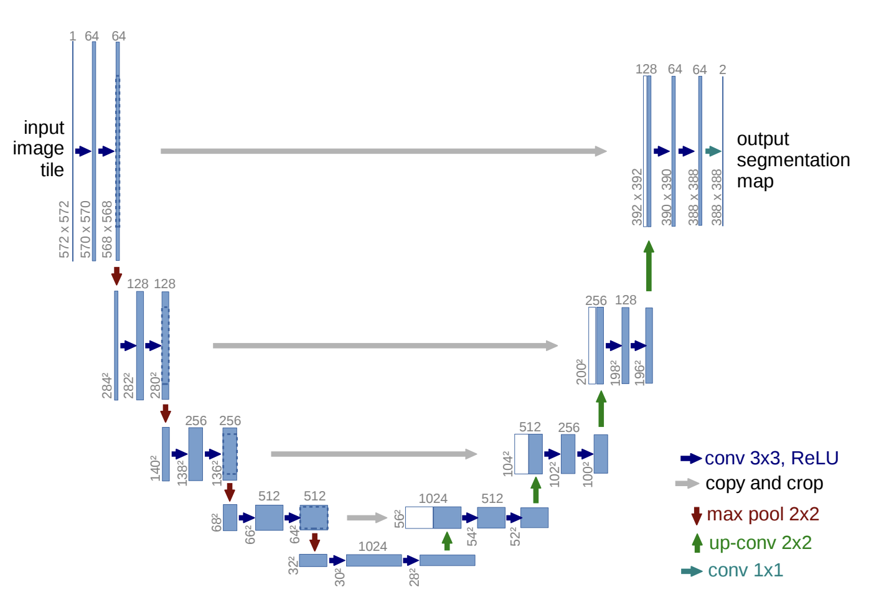

# COMP3710 Project: type of AI 
#### Student: s48824150
#### Name: Phoenix Macorkanis

#### Description:
Segment the HipMRI Study on Prostate Cancer (see Appendix for link) using the processed 2D slices (2D
images) available on Rangpur with the 2D UNet [3] with all labels having a minimum Dice similarity
coefficient of 0.75 on the test set on the prostate label. You will need to load Nifti file format and sample
code is provided in Appendix B. [Easy Difficulty]

## Table of Contents
1. hyperlink

## 1. Introduction
This report is for the final submission of comp3710 corse and the aim to to experiment with training a unet model to segment medical images. The report is based of the learnings of the content within Comp3710. something about the results

## 2. Project Structure
1. “modules.py" containing the source code of the components of your model. Each component must be
implementated as a class or a function
2. “dataset.py" containing the data loader for loading and preprocessing your data
3. “train.py" containing the source code for training, validating, testing and saving your model. The model
should be imported from “modules.py” and the data loader should be imported from “dataset.py”. Make
sure to plot the losses and metrics during training
4. “predict.py" showing example usage of your trained model. Print out any results and / or provide visualisations where applicable
5. “README.MD” to sufficiently document your project (see Section 6)

## 3. Reproductibility might not need

## 4. Dependencies 

Python 3.10.18
tensorflow 2.18
numpy 2.0.2
tensorboard 2.18
keras 3.11.2

## 5. AI type
The model architechture was based of the Unet design provied by an article "U-Net: Convolutional Networks for Biomedical Image Segmentation" [1]. The model downsizes and upscales using 3x3 convlution with relu acitvation. It also uses skip connections in the upscaling segments outputing with a sigmoid activation to create a probabilitic mask. The loss funciton is dice loss using giving ground truths to reference as the true version. 

## 6. Data Set
The data set was provided by the ISIC 2017 challenge where they have multiple samples of skin melanoma and ground truths to match. This was used as a paired zip within the network so the loss funciton can evaluate the predictions. The data set is processed within dataset.py for where it maps, splits, shuffles and prefetches. 

## 7. Training

evidence in graph formate of trainning

## 8. Validation 
how did you validate the model

## 9. Results
graphs of the output

## 10. Decussion 

## 11. References 
[1] O. Ronneberger, P. Fischer, and T. Brox, “U-Net: Convolutional Networks for Biomedical Image Segmentation,” arXiv preprint arXiv:1505.04597v1, May 2015.

[3] Codella N, Gutman D, Celebi ME, Helba B, Marchetti MA, Dusza S, Kalloo A, Liopyris K, Mishra N, Kittler H, Halpern A. "Skin Lesion Analysis Toward Melanoma Detection: A Challenge at the 2017 International Symposium on Biomedical Imaging (ISBI), Hosted by the International Skin Imaging Collaboration (ISIC)". arXiv: 1710.05006 [cs.CV]

F. Isensee, P. Kickingereder, W. Wick, M. Bendszus, and K. H. Maier-Hein, “Brain Tumor Segmentation and Radiomics — Survival Prediction: Contribution to the BRATS 2017 Challenge,” arXiv preprint arXiv:1802.10508v1, Feb. 2018.

google colab code for u net segmentation
https://colab.research.google.com/drive/1VOsZSyRhyuHLmgoqGriQk01ub4bKNmZ1?usp=sharing#scrollTo=015bef18
