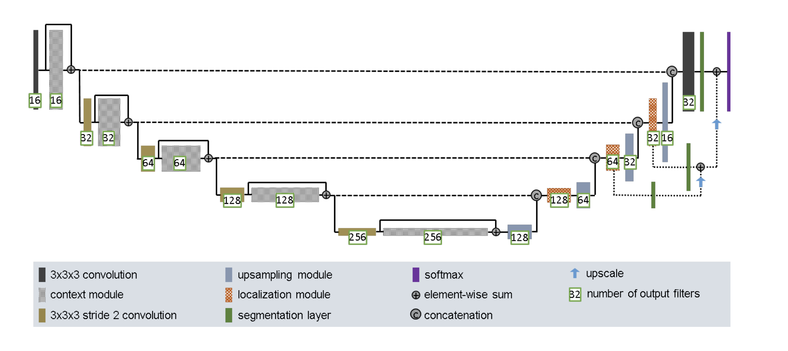
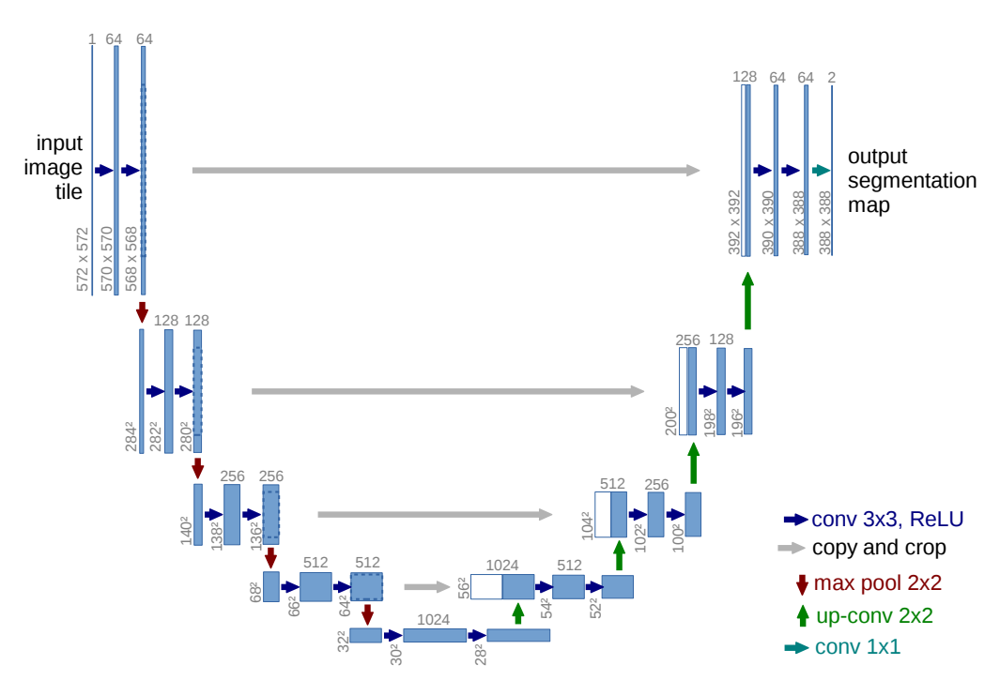
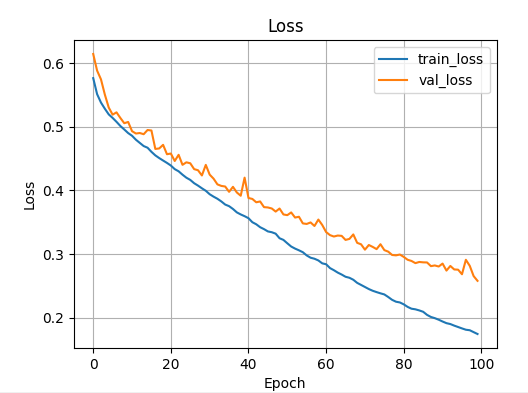
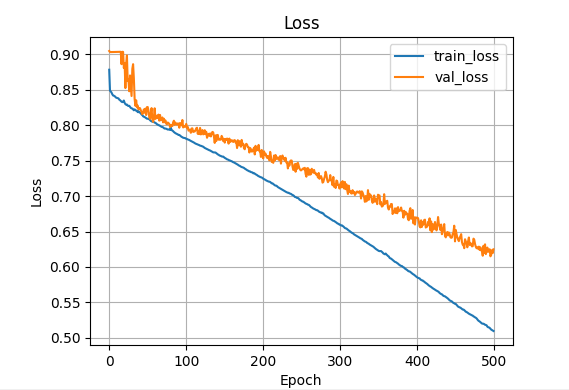

# COMP3710 Project: Improved Unet Design
#### Student: s48824150
#### Name: Phoenix Macorkanis

#### Description:
Segment the HipMRI Study on Prostate Cancer (see Appendix for link) using the processed 2D slices (2D
images) available on Rangpur with the 2D UNet with all labels having a minimum Dice similarity
coefficient of 0.75 on the test set on the prostate label. You will need to load Nifti file format and sample
code is provided in Appendix B. [Easy Difficulty]

## 1. Introduction
This report is for the final submission of COMP3710 course. The aim to to experiment with training a improved U-Net model to segment medical images, specifically prostate cancer. The model uses the tensorflow kera modules as a backbone for the code. The report is based of the learnings of the content within Comp3710. The improved U-Net model had an accuracy of 80% for 100 epochs

## 2. Dependencies 
The user of the script requires to download cuda tool kit for their GPU through the nivdia site:https://developer.nvidia.com/cuda-downloads. The cuda must be at least version 12. This report used a 3070ti RTX GPU to train the model. 

| Package | Version |
|--------|---------|
| Python | 3.9.23 |
| TensorFlow | 2.10.0 |
| Keras | 2.10.0 |
| NumPy | 1.23.5 |
| TensorBoard | 2.10.1 |
| Matplotlib | 3.9.2 |
| CUDA Toolkit | 11.2.2 |
| cuDNN | 8.1.0 |

The user of the script requires to download cuda tool kit for their GPU through the nivdia site:https://developer.nvidia.com/cuda-downloads. The cuda must be at least version 12. This report used a 3070ti RTX GPU to train the model. If the cuda tool kit is not installed then the gpu will not be used. Check first output from terminal after running predict.py to check if gpu is deteched.

| Package | Version |
|--------|---------|
| CUDA Toolkit | 11.2.2 |
| cuDNN | 8.1.0 |

## 3 Useage
After downloading dependices into enviroment. Download the model from [4] or https://data.csiro.au/collection/csiro:51392v2. Add the ReadNifti.py file into the dataset folder to read and seperate the files into scans and mask. Change dataset file paths in train.py. Run code from predict.py for full usage of training the visualising the training. Note: if numvisuilation != None. A folder will be created with the example images of each epoch (depending on argument input)

## 4. Model Architecture
The model architechture was based of the Unet design provied by an article "Brain Tumor Segmentation and Radiomics Survival Prediction: Contribution to the BraTS 2017 Challenge" [1]. 

The project idea was taken from "U-Net: Convolutional Networks for Biomedical Image Segmentation"[2] article. This article completes a very similar challenge for medical imaging segmentation of Drosophila first instar larva ventral nerve cord. 

Code for the prediction, loss function and data loading were inspired by the pytorch code for Unet segmentation avaliable on google colab. [3] “3D Improved UNet for Prostate Segmentation

## 5. Data Set
The data set was provided by Cisco where they surplied MR images of the male pelvis [4]. These files were presented as nifti files and had to be sepereated using nimbable module. This can be seen in ReadNifti.py where it splits the scans and the ground truths into differnet folders. After seperating and getting the images of the data, The keras processes funciton was used to:
- normalises; averages the pixels the images by dividing by 255 to make it a [0,1] value
- splits; creates a split for validation and training to test the model on unseen data
- shuffles; improves generatation of the model as it randomises the order of each image in the dataset for each epoch
- prefetches; loads the data early to reduce load time in later interations. 
The data was split into 80 : 20 training validation set then zipped into (img, mask) to be fed into the model. 

## 6. Hyperparameters 

train.py  
LEAKY_RELU_ALPHA = 0.2  
EPOCHS = 100  
DROPOUT_P = 0.3
LEARNING_RATE = 1e-4
SMOOTH = 1e-6  

dataset.py  
BATCH_SIZE = 10

## 7. Training

The model was trained using the ground truths to test the prediciton by the model during the epochs. The metric for evaluation was Dice Loss. Dice loss was the main metric as it compared the coverd areas of prediciton to the ground truth where coefficent = 1 would be a perfect coverage. [6] 

Examples of Training graph of the loss function over the epochs
### Label 1 Training

### Label 2 Training

## 8. Validation 
The model was vaildated using the validation dataset made in the train.py using dice and pixelwise comparision against the ground truths to get an average dice coeifficent and accuracy number. A plot is made of this comparision against all the validation dataset to spot any outliers from the average.

The model was validated to be "Validation (whole batch) — Dice: 0.9644, Accuracy: 0.8058"

### Lable 1

Final Prediction   

### Label 2

Final Prediction  

The 2nd label was much harder to train as the mask shape is much more complex to get a high dice percentage. This also due to the dice percentage not taking the black space around the mask into factor making it favour larger masks. The improved U-Net does not show any sign of over fitting allowing training of up to 500 epochs.

## 9. Discussion
The model performed increasing well taking a long time to produce any overfitting. Further evaluation and refinements of the model including looking the hyperparameters of the learning rates, relu alpha, dropout percent and loss funciton weight. Experiemention of these hyperparameters could create a faster or more accurate model output. Furthermore, training the model till overfitting would also be an interesting task to look into. Lastly, the time to train was heavily increase by the time it took to shuffle the dataset inbetween epochs. This could be due to the model having to read and write from the disc for every shuffle. Some research into a better shuffling method would speed up training the model by significant margins.

## 10. References 
[1] F. Isensee, P. Kickingereder, W. Wick, M. Bendszus, and K. H. Maier-Hein, “Brain Tumor Segmentation and Radiomics Survival Prediction: Contribution to the BraTS 2017 Challenge,” arXiv preprint arXiv:1802.10508v1, Feb. 2018.

[2] O. Ronneberger, P. Fischer, and T. Brox, “U-Net: Convolutional Networks for Biomedical Image Segmentation,” arXiv preprint arXiv:1505.04597v1, May 2015.

[3] X. Zhou, “3D Improved UNet for Prostate Segmentation,” Google Colab Notebook, Oct. 2025. Available: https://colab.research.google.com/drive/1VOsZSyRhyuHLmgoqGriQk01ub4bKNmZ1?usp=sharing

[4] CSIRO, “Australian Radiology NIfTI MRI Dataset,” CSIRO Data Collection, 2024. Available: https://data.csiro.au/collection/csiro:51392v2

[5] F. Isensee, P. Kickingereder, W. Wick, M. Bendszus, and K. H. Maier-Hein, “Brain Tumor Segmentation and Radiomics — Survival Prediction: Contribution to the BRATS 2017 Challenge,” arXiv preprint arXiv:1802.10508v1, Feb. 2018.

[6] Z. Y. Zheng, B. H. Tian, S. Yu, X. Yang, Q. Yu, J. Zhou, G. Jiang, Q. Zheng, J. Pu and L. Wang, “Adaptive boundary-enhanced Dice loss for image segmentation,” Biomedical Signal Processing and Control, vol. 106, Art. no. 107741, 2025. DOI: 10.1016/j.bspc.2025.107741.

[7] OpenAI, “ChatGPT (GPT-5),” OpenAI, San Francisco, CA, USA. Available: https://chat.openai.com/.

## Extra photos for presentation
Progress of training

Examples of training at epoch 1,11,21,31

### Label 1

### Label 2

